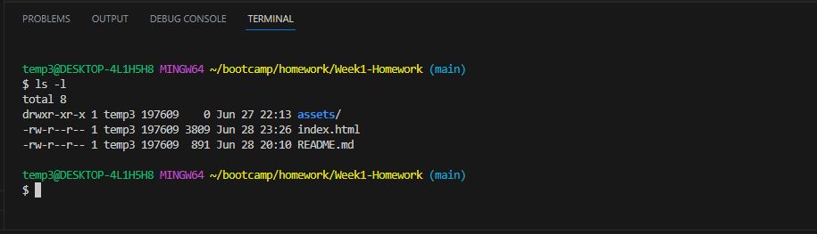

# <Week1-Homework>

## Description

I built this project for an SEO marketing company looking to enhance their website's accessibility! This update will allow as many users as possible to access the wesbite. It helps people with disabilities and mobile users and slower internet connections. In this challenge, I learned how to modify HTML and CSS to include semantic elements, HTML structure and hierarchy, and alt attributes on images.

## Locol Repo Screenshot

## Credits

I used this README template: 
https://coding-boot-camp.github.io/full-stack/github/professional-readme-guide

I read through these pages to help me with this Challenge: 
https://developer.mozilla.org/en-US/docs/Glossary/Semantics
https://developer.mozilla.org/en-US/docs/Learn/HTML/Introduction_to_HTML/Document_and_website_structure
https://developer.mozilla.org/en-US/docs/Learn/Getting_started_with_the_web/CSS_basics

